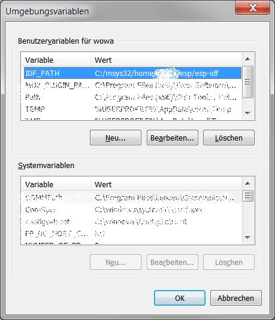

# Installation on Windows

## Install dependencies

To run the example on a Windows system, follow the [instructions](https://docs.espressif.com/projects/esp-idf/en/latest/get-started/windows-setup.html)
from Espressif 


## Setup Environment

After downloading and installing the msys2 and esp-idf, you need to set the path to the esp-idf. 
One way to do this, is to create a new environment variable in your system and add the path to the esp-idf, 
like shown in the picture below.



Follow the explanation from [README](README.md) to get the example and the neccessary libraries.

## Setup the Compiler
If you installed the msys to the standard drive, you can now edit the [toolchain-esp32.cmake](../esp-idf/tools/cmake/toolchain-esp32.cmake)
```cmake
set(CMAKE_C_COMPILER C:/msys32/opt/xtensa-esp32-elf/bin/xtensa-esp32-elf-gcc.exe)
set(CMAKE_CXX_COMPILER C:/msys32/opt/xtensa-esp32-elf/bin/xtensa-esp32-elf-g++.exe)
set(CMAKE_ASM_COMPILER C:/msys32/opt/xtensa-esp32-elf/bin/xtensa-esp32-elf-gcc.exe)
```
 Afterwards, run the [CMakeLists.txt](CMakeLists.txt) to generate all targets.
 
## Compile and flash

> CLion: Select `app` or `app-flash` to build and flash, then click on build.
